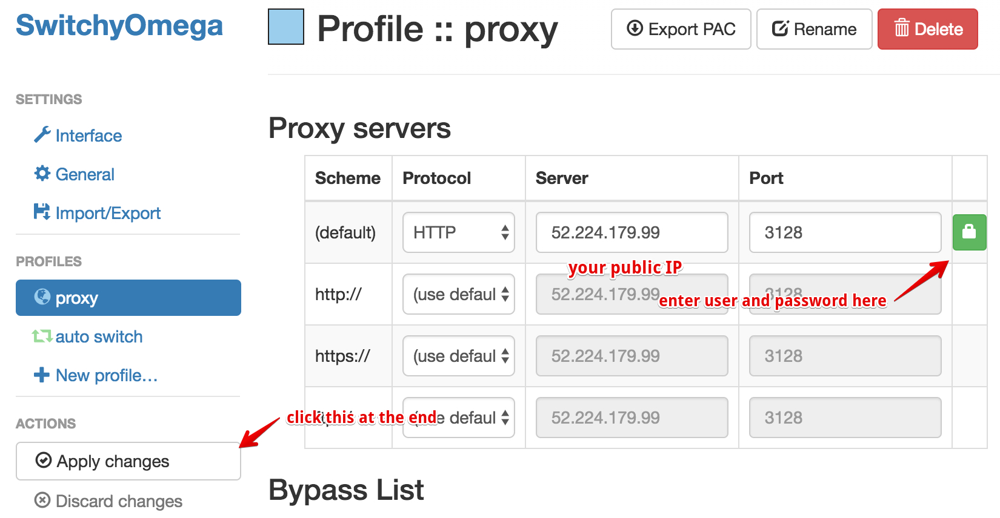
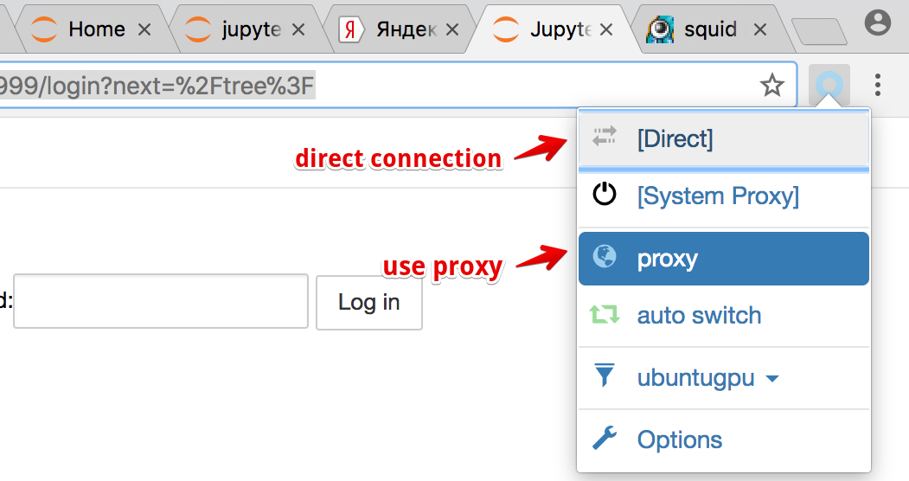

# Setup proxy for Chrome

## Create proxy

Create SOCKS proxy via ssh with
`ssh ubuntu@(paste public IP of virtual machine here) -ND 8157 -i ~/.ssh/*.pub` (Mac, Linux),
this will give you access to internal network of the virtual machine.

For Windows use https://www.math.ucla.edu/computing/kb/creating-ssh-proxy-tunnel-putty.

## Setup Chrome extension

You can use newly created SOCKS proxy with
[Proxy SwitchyOmega plugin](https://chrome.google.com/webstore/detail/proxy-switchyomega/padekgcemlokbadohgkifijomclgjgif?hl=en-GB)
for Chrome.

### Step 1:

### Step 2:

### Step 3:

